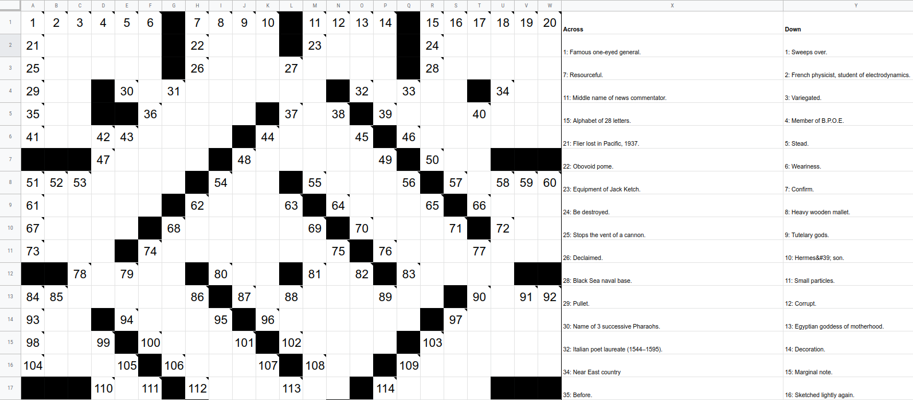

CrossSheet is a plugin for creating and completing crosswords collaboratively using Google Sheets

You can install CrossSheet for free from the G Suite Marketplace: [**Install**](https://gsuite.google.com/marketplace/app/crosssheet/720278429693)

Features of CrossSheet include:

- Collaborative crossword solving using the powerful Google Sheets platform
- Import crosswords from external sources like [The Guardian newspaper](https://www.theguardian.com/crosswords) and [XWord Info](https://www.xwordinfo.com/)
- Interactive formulas automatically cross out clues you have completed

For more information on how to install, use and develop CrossSheet, as well as legal information, please refer to
the [official website](https://tmiguelt.github.io/SheetsCrossword/).

